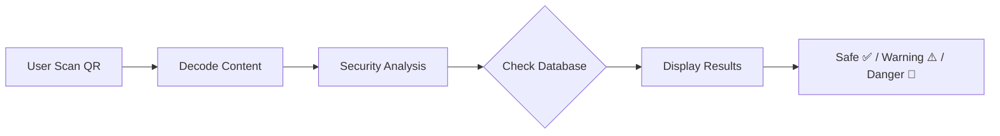

# 🔒 QR Safe Checker

> **Cek Keamanan QR Code Sebelum Scan & Bayar**

Web aplikasi gratis untuk menganalisis keamanan QR code sebelum melakukan pembayaran. Lindungi diri dari penipuan QR phishing, QRIS palsu, dan stiker scam.

[](LICENSE)
[](https://nextjs.org/)
[](https://supabase.com/)

---

## 🎯 Latar Belakang

Di Indonesia, kerugian akibat penipuan QR code mencapai **Rp 1,2 Triliun per tahun**. Proyek ini lahir dari pengalaman nyata teman yang kehilangan uang karena scan QR palsu.

**Masalah Utama:**

- 🚨 Stiker QR palsu ditempel di tempat asli
- 🔗 Link phishing mirip situs asli (tokopedi4.com)
- 💳 QRIS dengan nama merchant tidak sesuai
- 📊 73% korban tidak sadar sampai uang hilang

---

## ✨ Fitur

### 🔍 QR Scanner

- Scan dari kamera atau upload foto
- Auto-detect dalam 3 detik
- Support URL, QRIS, text, vCard, WiFi, dll

### 🛡️ Security Analysis

- Deteksi phishing & typosquatting
- Validasi format QRIS (standar BI)
- Check HTTPS, domain, TLD mencurigakan
- Warning untuk nominal besar

### 📊 Community Database

- Database QR scam yang dilaporkan
- Report system untuk QR mencurigakan
- Auto-warning jika 3+ laporan

---

## 🚀 Quick Start

```bash
# Clone repository
git clone https://github.com/yourusername/qr-safe-checker.git
cd qr-safe-checker

# Install dependencies
npm install

# Setup environment
cp .env.example .env.local
# Edit .env.local dengan Supabase credentials

# Run dev server
npm run dev
```

Buka [http://localhost:3000](http://localhost:3000)

---

## 🔧 Tech Stack

| Layer          | Technology                                |
| -------------- | ----------------------------------------- |
| **Frontend**   | Next.js 14, Tailwind CSS, Framer Motion   |
| **QR Decoder** | jsQR / @zxing/library                     |
| **Database**   | Supabase (PostgreSQL)                     |
| **Security**   | SHA-256, Levenshtein distance, EMV parser |
| **Deployment** | Vercel                                    |

---

## 📖 Cara Kerja



1. User scan/upload QR code
2. Decode konten (URL, QRIS, text)
3. Analisis keamanan (phishing, typo, format)
4. Cek database laporan scam
5. Tampilkan hasil dengan status keamanan

---

## 🗂️ Struktur Project

```
qr-safe-checker/
├── app/
│   ├── page.tsx              # Landing page
│   ├── scan/                 # Scanner (camera/upload)
│   ├── reports/              # Database scam
│   └── api/                  # API routes
├── components/               # UI components
├── lib/
│   ├── analyzers/           # Security analyzers
│   └── database/            # Supabase client
└── public/
```

---

## 🔐 Environment Variables

```env
NEXT_PUBLIC_SUPABASE_URL=your_supabase_project_url
NEXT_PUBLIC_SUPABASE_ANON_KEY=your_supabase_anon_key
SUPABASE_SERVICE_ROLE_KEY=your_service_role_key
```

---

## 🤝 Contributing

Kontribusi sangat welcome! Untuk berkontribusi:

1. Fork repository ini
2. Buat branch baru (`git checkout -b feature/AmazingFeature`)
3. Commit changes (`git commit -m 'Add some AmazingFeature'`)
4. Push ke branch (`git push origin feature/AmazingFeature`)
5. Buat Pull Request

---

## 📝 Roadmap

### Phase 1 (MVP) ✅

- [x] QR Scanner (camera & upload)
- [x] Security analyzers (URL & QRIS)
- [x] Report system
- [x] Scam database

### Phase 2 (Enhancement) 🚧

- [ ] URL expander untuk shortened links
- [ ] Google Safe Browsing API integration
- [ ] Admin dashboard untuk moderasi
- [ ] PWA support

### Phase 3 (Advanced) 💡

- [ ] Browser extension
- [ ] Machine learning pattern detection
- [ ] OCR untuk QR blur
- [ ] API untuk third-party integration

---

## 📄 License

Distributed under the MIT License. See `LICENSE` for more information.

---

## 💬 Contact

Project Link: [https://github.com/yourusername/qr-safe-checker](https://github.com/yourusername/qr-safe-checker)

---

## 🙏 Acknowledgments

- [Next.js](https://nextjs.org/)
- [Supabase](https://supabase.com/)
- [jsQR](https://github.com/cozmo/jsQR)
- [Tailwind CSS](https://tailwindcss.com/)
- [Framer Motion](https://www.framer.com/motion/)

---

**Dibuat dengan ❤️ untuk melindungi masyarakat Indonesia dari penipuan QR code.**

**Cek dulu, bayar aman!** 🔒
